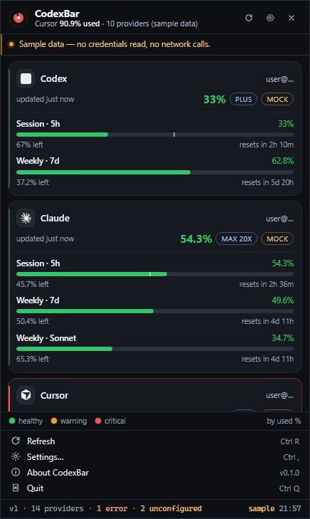
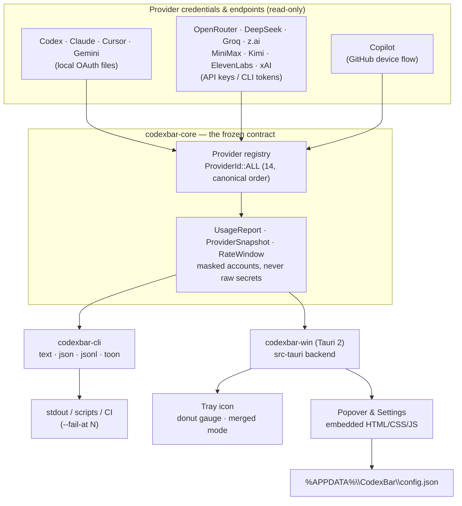
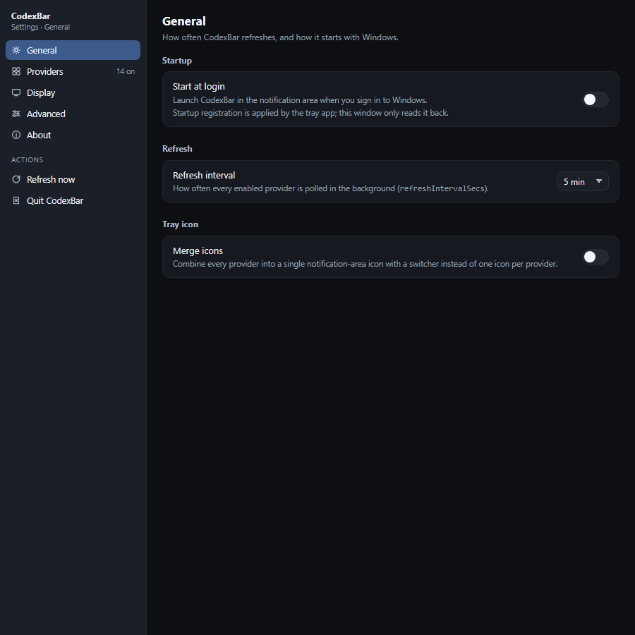
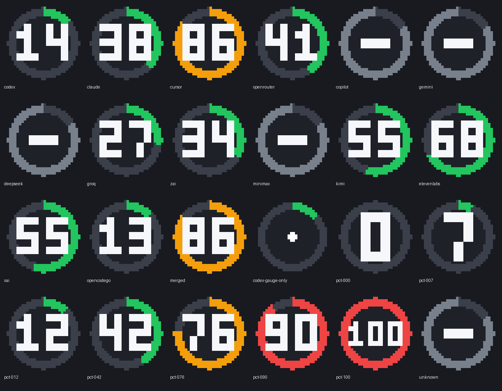

<div align="center">

# CodexBar for Windows

**See every AI coding provider's usage limits at a glance — straight from the Windows notification area.**

[](LICENSE)
[](#install--run)
[](https://www.rust-lang.org)
[](https://tauri.app)
[](#install--run)
[](#scope--roadmap)



</div>

A **Windows port of [CodexBar](https://github.com/steipete/CodexBar)** — the macOS
tray app that shows AI-provider usage limits at a glance — written from scratch in
**Rust + [Tauri 2](https://tauri.app)**.

It sits in the notification area, draws a small donut gauge (the arc tracks the
provider closest to its limit), and opens a flyout with one card per provider:
session and weekly windows, used percentage, a progress bar, the plan/tier and a
reset countdown. The same data is available from a `codexbar` CLI.

> **Not affiliated with the original project.** This is an independent,
> source-level port of the behaviour and data model of CodexBar (MIT). See
> [Credits & license](#credits--license).

---

## Why

- **Usage limits, live.** Session, weekly, monthly and credit windows per
  provider, each with a used percentage and a **reset countdown**.
- **A tray icon you can read at a glance.** One donut gauge per provider showing
  the used percentage, or a **single merged icon** with a switcher.
- **A popover with one card per provider** — plan/tier badge, progress bars and
  the reset time, in the canonical provider order.
- **Settings that persist** — enable/disable and reorder providers, refresh
  cadence, start-at-login and tray options, saved atomically to
  `%APPDATA%\CodexBar\config.json`.
- **A scriptable CLI** with `text`, `json`, `jsonl` and `toon` output, plus
  `--fail-at` for status bars and CI.
- **14 providers, one shared data contract.** Every fetcher returns the same
  `UsageReport` shape, so the CLI, the tray app and the UI can never disagree.
- **No separate login.** It reuses the sessions you already have (local OAuth
  files, env-var API keys, or the owning CLI's token), is **read-only**, and
  **never writes a credential** except when you explicitly connect Copilot.

## Providers (14)

| Provider | What it shows | Where it reads it (paths / env vars only) |
|---|---|---|
| **Codex** | Session · 5h, Weekly · 7d | `%USERPROFILE%\.codex\auth.json` (owned by the Codex CLI) |
| **Claude** | Session · 5h, Weekly · 7d, Weekly · Sonnet | `%USERPROFILE%\.claude\.credentials.json` (owned by Claude Code) |
| **Cursor** | Session · 5h, Weekly · 7d | Cursor's VS Code DB `state.vscdb` under `%APPDATA%\Cursor\User\globalStorage\` |
| **OpenRouter** | Credits · 30d + balance | `OPENROUTER_API_KEY` |
| **Copilot** | Session, weekly | GitHub device-flow token, stored by this app (see below) |
| **Gemini** | Session, weekly | `%USERPROFILE%\.gemini\oauth_creds.json` (owned by the Gemini CLI) |
| **DeepSeek** | Balance / usage | `DEEPSEEK_API_KEY` |
| **Groq** | Daily · tokens | `GROQ_API_KEY` (or a Groq console session token) |
| **z.ai** | Session · 5h, Weekly · 7d | `Z_AI_API_KEY` |
| **MiniMax** | Session, weekly | `MINIMAX_CODING_API_KEY` (or `MINIMAX_API_KEY`) |
| **Kimi** | Rate limit · 5h, Weekly · plan | `KIMI_CODE_API_KEY`, or the read-only token in `%USERPROFILE%\.kimi-code\credentials\kimi-code.json` |
| **ElevenLabs** | Characters · monthly, Voice slots, Professional voices | `ELEVENLABS_API_KEY` (or `XI_API_KEY`) |
| **xAI** | Prepaid · 30d | `XAI_MANAGEMENT_API_KEY` |
| **OpenCode Go** | Session · 5h, Weekly · 7d, Monthly · 30d | `OPENCODE_API_KEY`, or an existing OpenCode login |

Only **paths and environment-variable names** are listed here — never values.
`%APPDATA%\CodexBar\config.json` is this app's own settings file.

## Install & run

**Requirements**

- **Windows 10 or 11**
- **WebView2 runtime** (preinstalled on Windows 11 and recent Windows 10 — see
  the [Microsoft docs](https://learn.microsoft.com/en-us/microsoft-edge/webview2/) if it is missing)
- To build from source: **Rust (MSVC toolchain), stable ≥ 1.77**, and the
  WebView2 **build** prerequisites. No Node.js or bundler is needed — the
  frontend is plain HTML/CSS/JS embedded at compile time.

**Build from source**

```bash
# from the repository root (the winapp/ workspace)
cargo build --release -p codexbar-win   # -> target/release/codexbar-win.exe  (tray app)
cargo build --release -p codexbar-cli   # -> target/release/codexbar.exe      (CLI)

cargo test --workspace                   # 405 tests, offline, no network
```

**Use the tray app.** Launch `codexbar-win.exe`; it lives in the notification
area (no window unless you open the flyout). Left-click the icon for the usage
flyout, right-click for the menu (*Refresh now*, *Settings…*, *Quit*). The icon's
donut arc tracks the provider closest to its limit. `codexbar-win.exe --show`
opens the popover immediately.

**Use the CLI.**

```
codexbar usage [--format text|json|jsonl|toon] [--provider <id>] [--live] [--fail-at <pct>]
codexbar providers
codexbar schema
```

Real output — `codexbar usage`, mock mode (default, no credentials read, no
network), trimmed to a few providers:

```
$ codexbar usage
Codex 33%
  Session · 5h      33.0% used  resets in 2h 9m
  Weekly · 7d       62.8% used  resets in 5d 19h
Claude 54%
  Session · 5h      54.3% used  resets in 2h 35m
  Weekly · 7d       49.6% used  resets in 4d 10h
  Weekly · Sonnet   34.7% used  resets in 4d 10h
Cursor 91%
  Session · 5h      90.9% used  resets in 3h 23m
  Weekly · 7d       97.0% used  resets in 5d 15h
OpenRouter 52%
  Credits · 30d     52.2% used  resets in 5d 9h
Copilot —
  note: No credentials found — open Settings to connect this provider.

most constrained: Cursor 91% used
source: mock (no credentials read, no network calls)
```

`--live` switches from the deterministic mock registry to the real fetchers;
with no credentials it stays offline and reports `notConfigured`. Both modes emit
the **same payload shape**, and credential values never reach stdout — `account`
only ever carries a masked stub (`user@example.com` → `user@…`,
`sk-or-v1…9f2c`). `--fail-at N` exits **3** when any provider is at or above
N % used, so it drops into scripts and status bars unchanged.

## Architecture



Every provider implements `codexbar_core::Provider` and returns a
`ProviderSnapshot`; `collect()` sorts them by `ProviderId::ALL`, the CLI and the
Tauri backend both read that one payload, and the UI renders whatever `windows`
a provider returns. `CONTRACT.md` documents the contract in full.

## Screenshots

<div align="center">





</div>

All captures come from the built-in **mock fixture** — sample data, no
credentials read, no network calls, no real accounts.

## Security & privacy

- **Read-only.** The port only ever *reads* existing credentials. It never
  prints, logs, uploads or stores a secret value, and no credential value
  appears in a report, an error or a tooltip.
- **It does not refresh tokens.** For providers whose session belongs to another
  tool (Codex, Claude, Cursor, Gemini), token refresh is delegated to the CLI
  that owns the file (`codex login`, `claude`, …). When such a session is dead,
  the app shows an actionable *re-authenticate* state instead of trying to fix
  it — matching how the original behaves.
- **The one exception is Copilot:** its device-flow token is written atomically
  to this app's own config (`%APPDATA%\CodexBar\config.json`) and is never
  printed.
- **Masked at the boundary.** E-mail addresses and account IDs are abbreviated
  (`user@…`, `sk-or-1v…9f2c`) inside the fetcher, before they can reach a
  payload, the popover or a screenshot.
- **An evidence hygiene gate.** Every screenshot in the repo is checked for raw
  UUIDs, real e-mail addresses, tokens and stale config paths, and each PNG must
  be listed in `evidence/capture-manifest.json` as `containsPii: false` — the
  build fails rather than ship a leaked capture.

## Scope & roadmap

This port is honest about how far along it is:

- **14 of ~85 providers.** The original CodexBar supports roughly eighty-five;
  the rest are **not ported**. Each shipping provider has a real fetcher and an
  offline fixture test.
- **Not included:** cost or usage-history views (parsing provider logs), desktop
  notifications, a desktop widget, auto-update, and a packaged installer.
  `bundle.targets` is configured but has not been exercised — you build and run
  the binaries yourself.
- A provider without local credentials reports `notConfigured` — it never
  invents a number. New endpoints are pinned to HTTPS and validated before use;
  where an endpoint or credential shape could not be verified against a live
  account, the behaviour is documented rather than guessed (see
  `docs/port-specs/`).

## Credits & license

This project is **MIT-licensed** — see [`LICENSE`](LICENSE).

It is a port of **[CodexBar](https://github.com/steipete/CodexBar)** by
**Peter Steinberger**, also MIT. The original's design, data model and product
invariants (read-only credential access, never refreshing shared tokens,
delegating recovery to the owning CLI) are carried over deliberately; all
Windows-specific code here is original.

This is an **independent project and is not affiliated with, endorsed by, or
maintained by** the original author or the upstream CodexBar project.

- Original: <https://github.com/steipete/CodexBar>
- This port: <https://github.com/EndingVE/Codex-Windows-Port>
